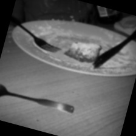
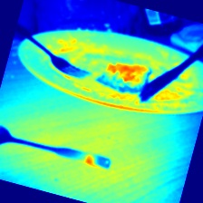
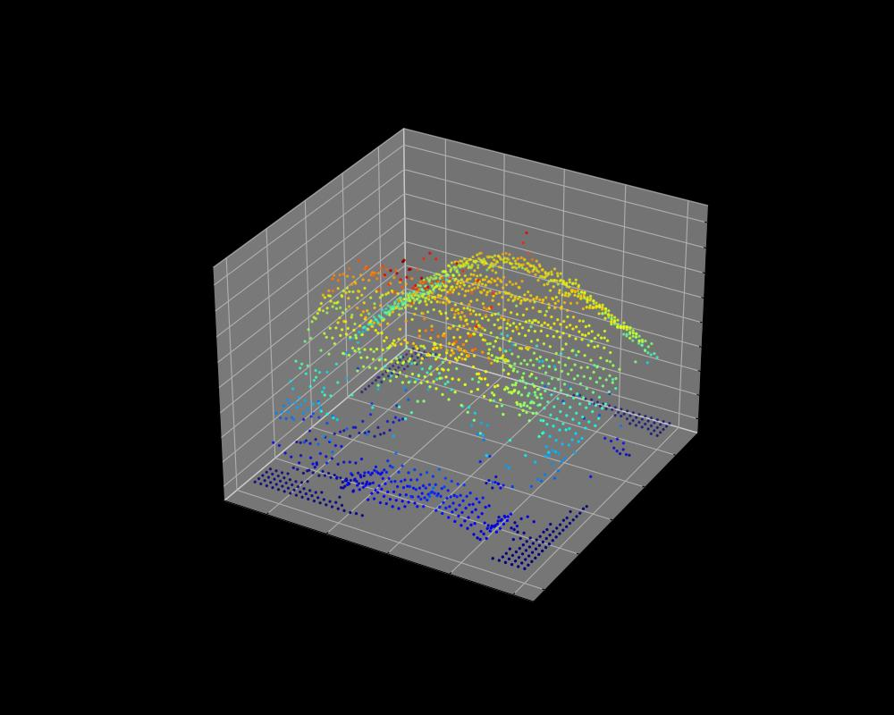

# 2주차: 2D 이미지의 3D Point Cloud 시각화 및 결과 자동 저장

## 개요
1주차에서 만든 흑백 이미지의 **밝기 값을 Z축으로 사용**해 3D 산점도(Point Cloud 형태)로 시각화하고, 결과를 세 가지 형태로 자동 분류해 저장합니다.

> ⚠️ 여기서 말하는 "깊이"는 실제 거리(depth)가 아니라 **픽셀 밝기를 높이로 바꾼 의사(pseudo) 깊이**입니다.  
> 실제 깊이 정보는 스테레오·ToF 같은 뎁스 카메라나 단안 깊이 추정 모델이 필요합니다. 이 과제의 목적은 2D 데이터를 3D 좌표로 바꿔 시각화하는 흐름을 익히는 것입니다.

## 핵심 구현
1. **모듈화와 단위 테스트**
   - 실행 코드(`src/`)와 테스트 코드(`tests/`)를 분리했습니다.
   - `pytest` 테스트 5개: 출력 형태, `None` 입력 예외, 반환 타입, 잘못된 타입 입력 예외, 흰색·검은색 극단값 변환을 검증합니다.
2. **3D 시각화**
   - 5픽셀 간격으로 샘플링한 (x, y, 밝기) 좌표를 matplotlib 3D 산점도로 그립니다.
   - `cmap='jet'`으로 밝기가 높을수록 빨강, 낮을수록 파랑으로 표시합니다.
3. **결과 자동 저장**
   - 입력 이미지마다 원본, 2D JET 컬러맵, 3D 산점도 캡처를 각각의 폴더에 저장합니다.

## 디렉토리 구조
```text
week2/
├── src/
│   ├── __init__.py
│   └── depth_to_3d.py         # 의사 깊이 맵 생성, 시각화, 결과 저장
├── tests/
│   ├── __init__.py
│   └── test_3d_processing.py  # 단위 테스트 5개
├── results_1_preprocessed/    # 입력 이미지 사본
├── results_2_colormap/        # JET 컬러맵 이미지
├── results_3_pointcloud/      # 3D 산점도 캡처
└── README.md
```

## 실행

```bash
cd week2                    # 반드시 week2 폴더 안에서 실행
pip install -r requirements.txt
python src/depth_to_3d.py
pytest
```

정상 실행 시 출력:
```
[1/5] preprocessed_0.jpg -> 3가지 버전으로 저장 완료함.
...
[5/5] preprocessed_4.jpg -> 3가지 버전으로 저장 완료함.
```
```
5 passed
```

## 결과 예시

| 입력 (흑백) | JET 컬러맵 | 3D 산점도 |
|---|---|---|
|  |  |  |
